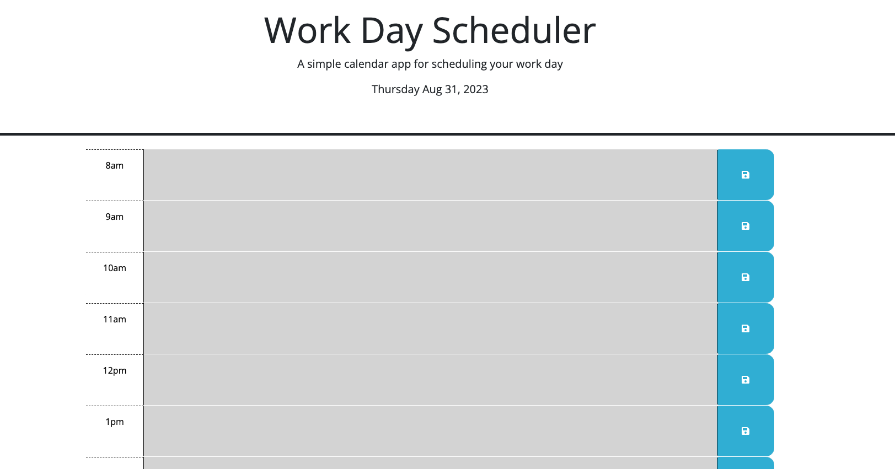
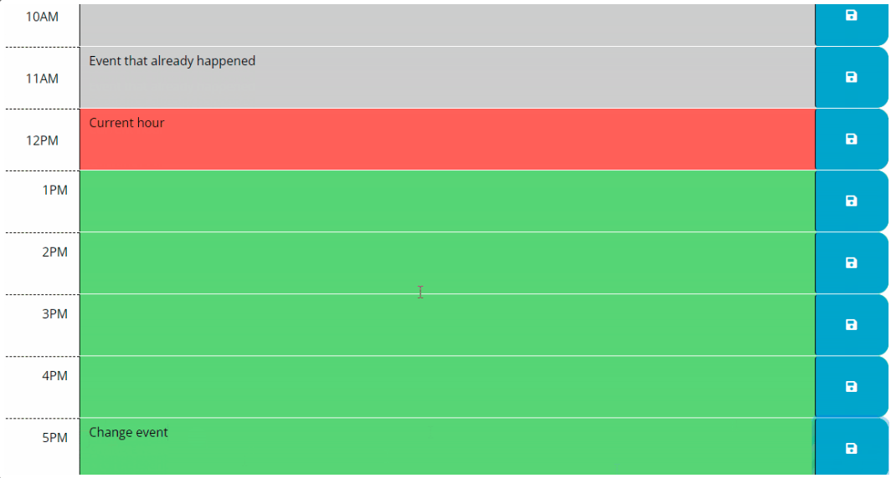

# Day-Planner

## To help plan your work day!

This day planner was created to help you plan your tasks for the day as meticulously as you want.
Your schedule will never get out of hand with this amazing new tool. It will even remember your past entries! Cool!

### Usage

Please visit my [Site!](https://tayskully.github.io/day-planner/)
In order to get the full experience, users must enter in their work-day activities into the text boxes, and click the save button on the right. If the user's current time is within working hours-- the past hours will be grey, the present hour will be red, and the future hours will be green. Once you enter your schedule and hit save, the data will be waiting for you when you get back.

The interaction may look like the following screenshots:

### Credits

The collaborators on this project include me, myself, and Taylor
@tayskully
third-party assets
Tutorials followed include Columbia University EdX's Coding Bootcamp 2023, as well as:  
 [Github Docs](https://docs.github.com/en)  
 [developer mozilla](https://developer.mozilla.org/en-US/)  
 [Dev.to](https://dev.to/)  
 [Code Academy blogs](https://www.codecademy.com/resources/blog/)

Special thanks to my tutor Erik Hirsch for helping me debug!

### License

MIT License
